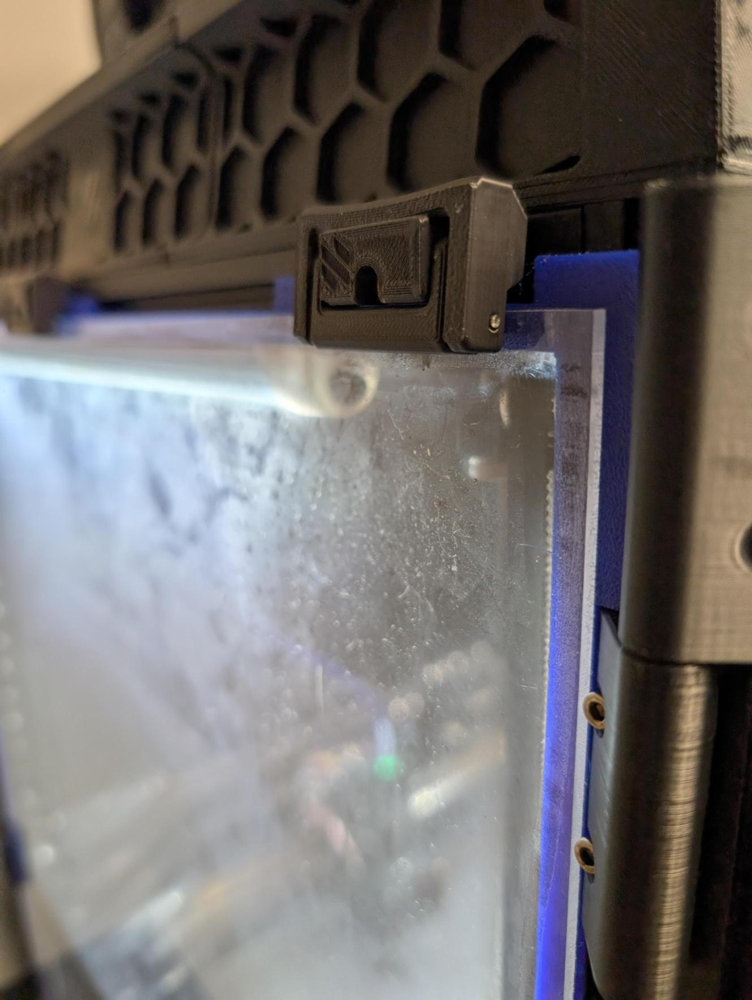
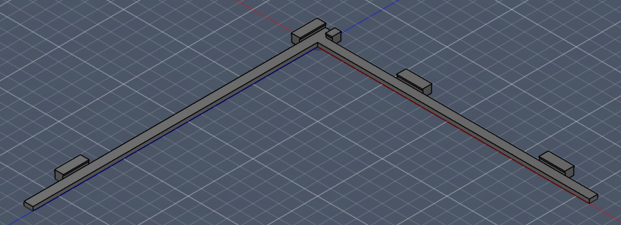

# TPU gasket for panels on 2020 extrusion

*Always open to constructive criticism!*

## Why does this exist?
I was always pretty disappointed with the foam tape gaskets that were included in my kit. Over time the adhesive fails, and the gaskets will shift, or stick to the extrusion when removing the panel. You are also left with little options when it comes to cleaning a panel with adhesive foam stuck to it. This is my solution.

## Important note!
These were designed around the [clicky-clack fridge door](https://github.com/tanaes/whopping_Voron_mods/tree/main/clickyclacky_door), and printable [snap latches](https://github.com/VoronDesign/VoronUsers/tree/main/printer_mods/richardjm/snap-latch-2020). This gasket will not fit with the standard panel clips.

## Hardware
- None required! Push directly into the extrusion.

## Printing
- Gasket was designed with a 0.6mm nozzle in mind
- Tested with 85A shore hardness
- 3 files per printer size. Top and bottom for the hinged side of the printer, and one for the handle side.
- Each print is a quarter. Top and bottom hinge side are mirrored. Handle side is printed twice, mirrored twice.

## Changes
2026-03-03: Released